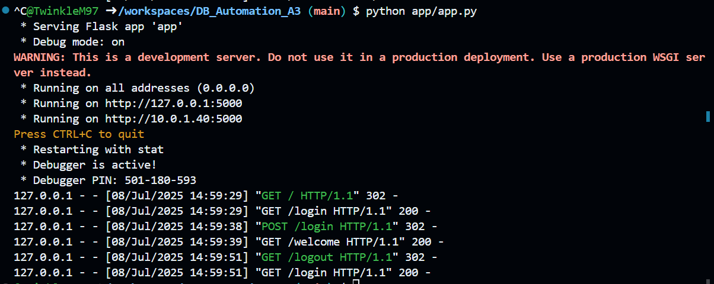
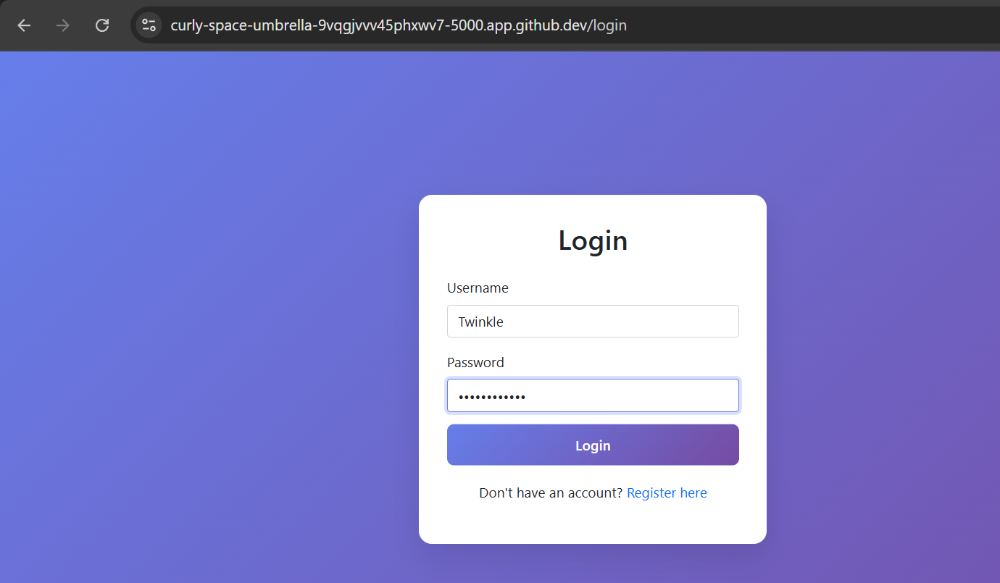
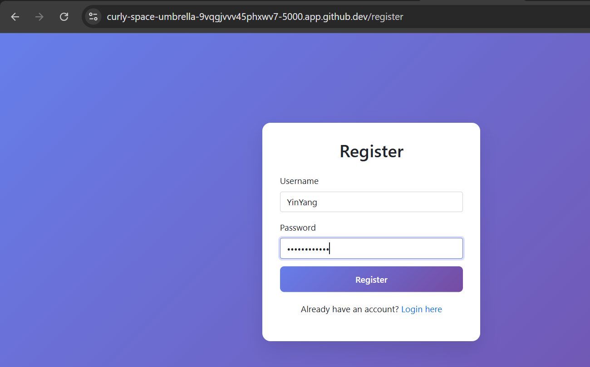
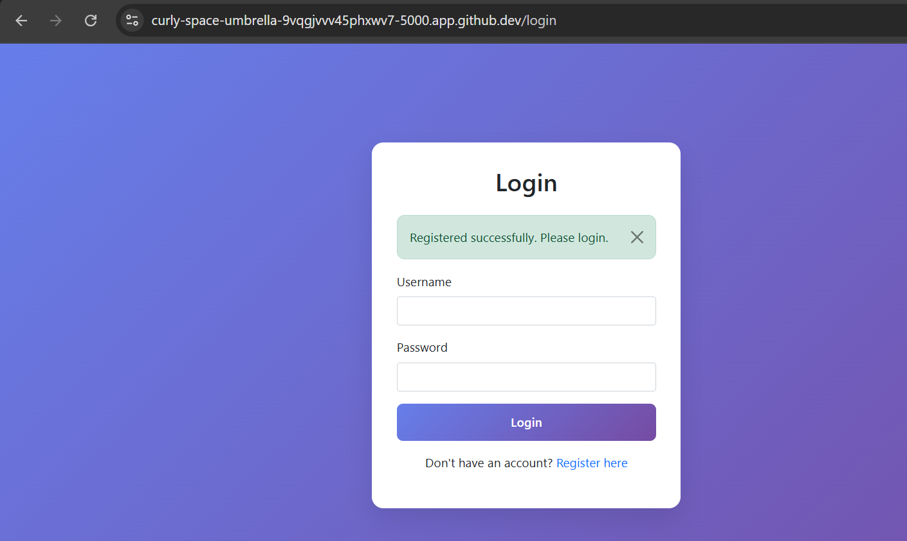
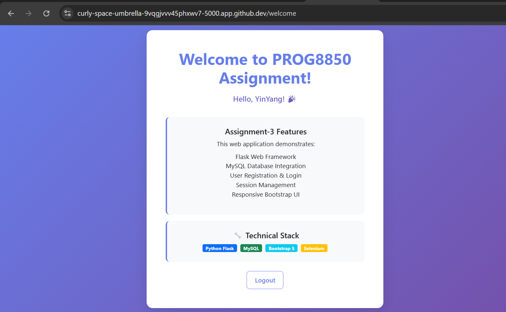
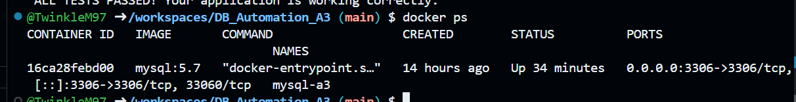
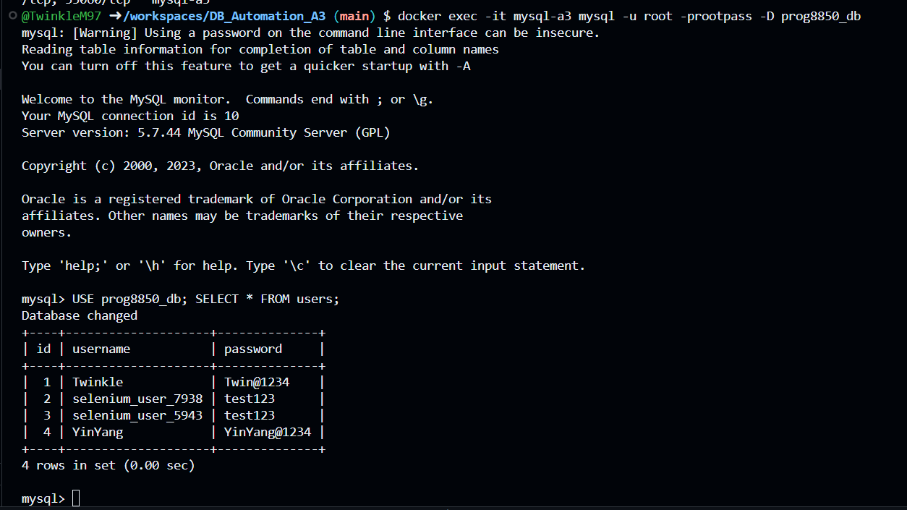
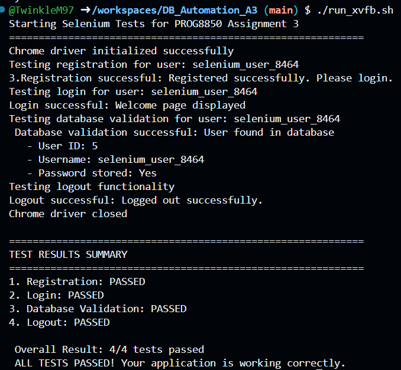
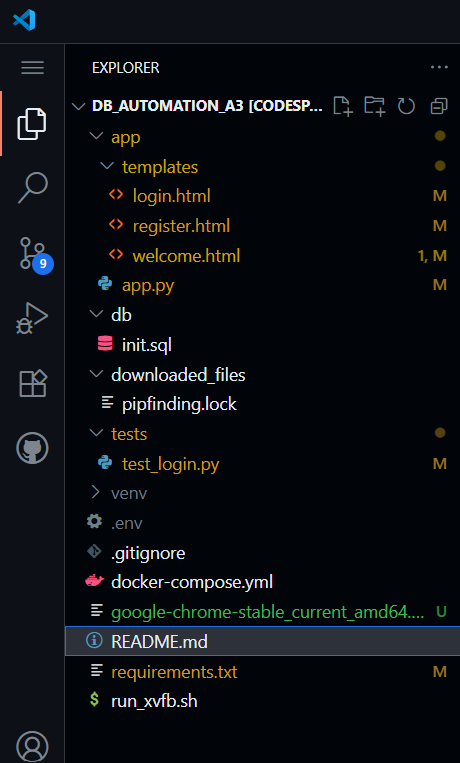
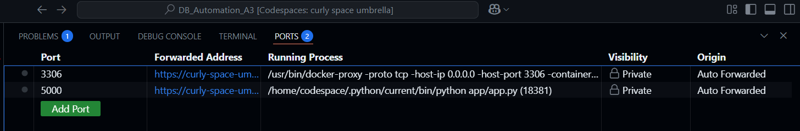

# PROG8850 – Assignment 3: Web App + Selenium Automation

**Student**: Twinkle Mishra  
**Student ID**: 8894858  
**Course**: PROG8850 – Database Automation and Scripting  
**Assignment**: Assignment 3 – Automating Login UI and Testing with Selenium  
**Date**: 8 July 2025

---

## Objective

To build and test a full-stack login/registration web app with:
- Flask UI
- MySQL backend
- Selenium-based automated testing
- Dockerized database
- Headless browser testing in Codespaces

---

## Project Structure

```
DB_Automation_A3/
├── app/
│   ├── app.py
│   ├── templates/
│   │   ├── login.html
│   │   ├── register.html
│   │   └── welcome.html
├── tests/
│   └── test_login.py
├── .env
├── requirements.txt
├── docker-compose.yml
├── init.sql
├── run_xvfb.sh
└── README.md
```

---

## Environment Setup

### 1. Python Dependencies
```bash
pip install -r requirements.txt
```

`requirements.txt`:
```
flask
mysql-connector-python
python-dotenv
selenium
webdriver-manager
```

### 2. System Dependencies for Selenium (in Codespaces)

```bash
sudo apt update && sudo apt install -y   wget curl gnupg unzip xvfb libxi6 libgconf-2-4 libnss3 libxss1 libappindicator1 libindicator7   fonts-liberation libatk-bridge2.0-0 libgtk-3-0

# Install Chrome browser
wget https://dl.google.com/linux/direct/google-chrome-stable_current_amd64.deb
sudo dpkg -i google-chrome-stable_current_amd64.deb || sudo apt -f install -y
```

---

##  .env Configuration

`.env` file:
```ini
DB_HOST=127.0.0.1
DB_PORT=3306
DB_USER=student
DB_PASS=studentpass
DB_NAME=prog8850_db
```

---

## MySQL Setup via Docker

```bash
docker-compose up -d
```

To verify:
```bash
docker ps
docker exec -it mysql-a3 mysql -u root -prootpass -e "USE prog8850_db; SHOW TABLES;"
```

---

## Running the Flask App

```bash
python app/app.py
```

Then access:
- Register: https://curly-space-umbrella-9vqgjvvv45phxwv7-5000.app.github.dev/register
- Login: https://curly-space-umbrella-9vqgjvvv45phxwv7-5000.app.github.dev/login

---

## Running Selenium Tests

Use the `run_xvfb.sh` script in Codespaces to launch the virtual display and test:

```bash
chmod +x run_xvfb.sh
./run_xvfb.sh
```

This performs:
1. User registration
2. Login
3. Welcome screen validation
4. DB check for user
5. Logout

Test output will be shown in terminal.

---
##  Required Screenshots

### 1. Flask app running


### 2. Login Page


### 3. Register Page


### 4. Registration Success


### 5. Welcome Page after Login


### 6. MySQL Container Running


### 7. User Inserted in Database


### 8. Selenium Tests Passed


### 9. Project Structure and .env File


### 10. Port Forwarding URL (Codespaces)



| Screenshot File Name                 | Description                              |
|--------------------------------------|------------------------------------------|
| `1_flask_app_running.png`            | Flask server up and running              |
| `2_login_page.png`                   | Login form UI                            |
| `3_register_page.png`                | Register form UI                         |
| `4_register_success.png`            | Successful registration message          |
| `5_login_success_welcome_page.png`  | Welcome page after login                 |
| `6_mysql_container_running.png`     | `docker ps` showing MySQL running        |
| `7_user_inserted_in_database.png`   | SELECT query showing test user in MySQL  |
| `8_selenium_tests_passed.png`       | CLI output of successful Selenium test   |
| `9_project_structure_and_env.png`   | Project folder structure + .env file     |
| `10_port_forwarding_url.png`        | Port 5000 forwarded in Codespaces        |


## GitHub Repository

All files, Docker Compose, `.env.example`, test script and screenshots are committed and pushed to:

`[https://github.com/TwinkleM97/DB_Automation_A3](https://github.com/TwinkleM97/A3_DB_Automation)` 

---

## Security Disclaimer

Passwords are stored in plaintext to meet assignment visibility needs. In production, use:
```python
from werkzeug.security import generate_password_hash, check_password_hash
```

---

